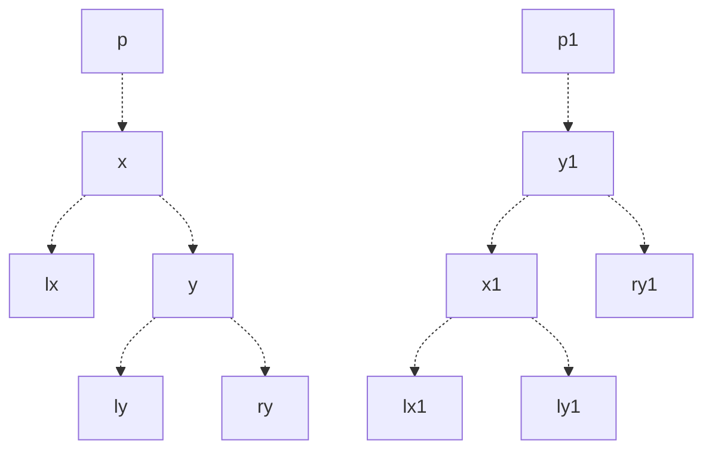
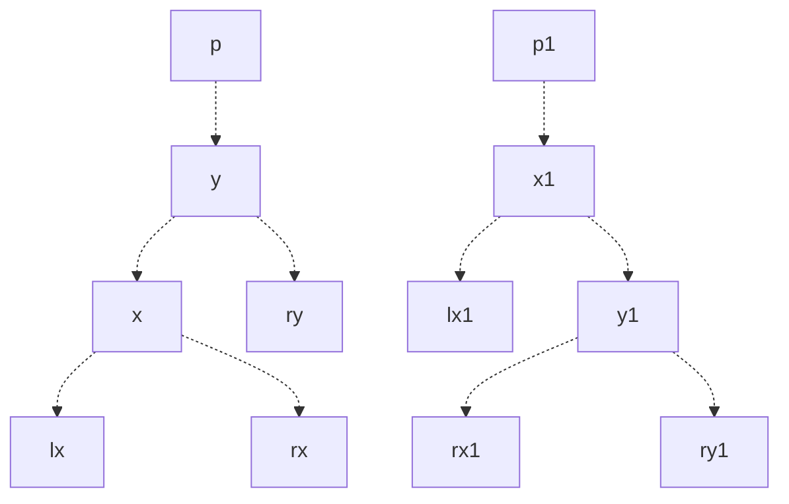

[红黑树总结](https://www.cnblogs.com/lukazan/p/14702151.html)

[彻底理解红黑树（三）之 删除](https://jianshu.com/p/84416644c080)

# 红黑树

## 右旋



## 左旋


# 排序

## 冒泡排序

```java
    // 冒泡排序
    static public int[] maopao(int[] arr) {
        for (int i = 0; i < arr.length; i++) {
            for (int j = 1; j < arr.length - i; j++) {
                int temp;
                if (arr[j] < arr[j - 1]) {
                    temp = arr[j];
                    arr[j] = arr[j - 1];
                    arr[j - 1] = temp;
                }
            }
        }
        return arr;
    }
```

## 选择排序

```java
    // 选择排序
    static public int[] xuanze(int[] arr) {
        for (int i = 0; i < arr.length; i++) {
            int min = i, temp;
            for (int j = i + 1; j < arr.length; j++) {
                if (arr[min] > arr[j]) {
                    min = j;
                }
            }
            temp = arr[i];
            arr[i] = arr[min];
            arr[min] = temp;
        }
        return arr;
    }
```

## 插入排序

```java
    // 插入排序
    static public int[] charu(int[] arr) {
        for (int i = 1; i < arr.length; i++) {
            int j = i, temp;
            while (j > 0 && arr[j] < arr[j - 1]) {
                temp = arr[j];
                arr[j] = arr[j - 1];
                arr[j - 1] = temp;
                j--;
            }
        }
        return arr;
    }
```

## 快速排序

```java
    // 快速排序
    public static int[] kuaipai(int[] arr, int low, int high) {
        if (low >= high) {
            return null;
        }
        int pivot = partition(arr, low, high);
        kuaipai(arr, low, pivot - 1);
        kuaipai(arr, pivot + 1, high);
        return arr;
    }
    public static int partition(int[] arr, int low, int high) {
        int pivot = arr[low];
        while (low < high) {
            while (low < high && arr[high] >= pivot) --high;
            arr[low] = arr[high];
            while (low < high && arr[low] <= pivot) ++low;
            arr[high] = arr[low];
        }
        arr[low] = pivot;
        return low;
    }
```
